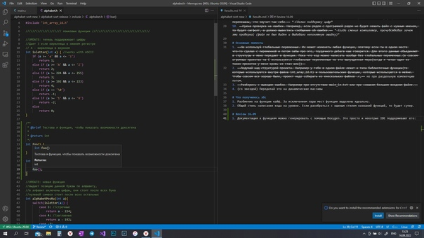

# Замечания по коду 
1. ~~Зачем писать extern в мейне? Лучше вообще не использовать глобальные переменные. Если не хочешь передавать много параметров, то создай структуру со всеми нужными полями и передавай ее.~~
2. ~~В мейне надо бы возвращаемое значение писать~~
3. ~~Чтобы алгоритм сортировки был более понятным, нужно написать функцию swap(), которая меняет строки местами через локальный буфер.~~
4. ~~Лучше не начинать переменные с подчеркивания. Так можно мпутать с бибилиотечными функциями + подчеркивание можно в конец поставить.~~
За это меня тоже пиздили. *-ахахахаха*
5. Изучи динамическую память (malloc, free и realloc). В этой задаче можешь пока на статических массивах работать, но на будущее динамическую память обязательно знать.
6. ~~Надо выводить сообщение в терминал, если закончился статический массив. Насколько я понял сейчас программа просто молча сортирует сколько может даже если файл больше массива.~~
7. ~~Надо поддерживать кодстайл. У тебя некоторые функции называюьтся через подчеркивания, а некоторые в одно слово(выбери один способ и используй). Если хочешь разделить библиотечные функции и пользовательские, то используй подчеркивания в конце(подробнее про библиотечные функции ниже).~~
8. ~~Очевидное дублирвоание кода~~ 
```
if (st1 == 3)
    c1 = array2d_r(i, y1) - 224;//'а'
else if (st1 == 4)
    c1 = array2d_r(i, y1) - 192;//'А'
else if (st1 == -1)
    c1 = 255 - 224 + 1;

if (st2 == 3)
    c2 = array2d_r(j, y2) - 224;//'а'
else if (st2 == 4)
    c2 = array2d_r(j, y2) - 192;//'А'
else if (st2 == -1)
    c2 = 255 - 224 + 1;
```
~~Нету ни одной причины почему это не должно быть в отдельной функции.~~
9. ~~Если строки не содержат ни одной буквы, то они равны? Если так, то строки из чисел будут рандомно перемешаны, что звучит так себе.~~ *-Сделал поддержку цифр*
10. ~~Нужна проверка на ошибки. Например, если рядом с программой рядом не будет лежать файл с нужным именем, то будет сигфолт, а должно вывестись сообщение об ошибке.~~ *-Когда сменил компилятор, прочувствовал зачем эта проверка) (файл не был виден и выдавало непонятную ошибку)*

# Основные моменты 
1. ~~Не используй глобальные переменные. Их может изменять любая функция, поэтому если ты в одном месте что-то сделал с переменной и потом забы про это, тоудачного дебага как говорится. Для этого данные объединяют в структуры и явно передают в функции. Пока что код можно написать вообще без глобальных переменных.(в совсем огромных проектах на С используются глобальные перепменные но это вынужденная мера(когда я читал один из таких проектов у меня кровь из глаз шла))~~
2. ~~Подумай над структурой проекта. Например у тебя в одном файле лежат и типа библиотечные функции(те которые используются внутри файла int_aray_2d.h) и пользовательские функции, которые используются в мейне. Чтобы совсем все хорошо было, проект надо собирать из енескольких файлов .с,~~ но про раздельную компилчцию потом.
3. ~~Разберись с выводом ошибок. Например при отсутствии main_in.txt или при слишком большом входном файле.~~
4. (со звездой) Переделай это на динамические массивы

# Что получилось збс
1. Разбиение на функции кайф. За исключением пары мест функции выделены идеально.
2. Общий стиль написания кода на уровне. Если разобраться с единым стилем названий функций, то будет супер.


# Review 16.09
1. Документация к функциям можно генерировать с помощью Doxygen. Это просто и некотрые IDE поддерживают его:



2. ~~alphabetRUY() можно переименовать в compare() так очевиднее будет.~~ 
3. ~~переменные лучше называть более информативно. Например в alphabetRUY() название s мало о чем говорит, а переменные str1, str2 вводят в заблуждение тк хроанят буквы, а называются как строки. Примеры замен:~~
- s -> line/second_line
- y1 -> first_line_num
- str1 -> letter_to_cmp_1
- str2 -> letter_to_cmp_2
4. ~~Константы лучше использовать через #define~~ 

```cpp
#define LINE_TERMINATOR 255 - 224 + 11

do {
        
} while (st1 != LINE_TERMINATOR && st2 != LINE_TERMINATOR && i++ < MAX_X && j++ < MAX_X);
```
5. ~~Наверно лучше getline2 назвать просто getline тк ее удобно использовать во многих програмах~~ *Компилятор жалуется на переопределение, видно что-то есть в стдио точка аш*
6. ~~Если уж ты собираешь через CMake, то надо разделить определение фукнкции и ее реализацию. В хелерах должны быть только прототипы функций. Реализации должны лежать в отдельном .c файле с тем же названием, что и .h. Линкер все слинкует.~~

(это скорее на будущее тк в онегине функций мало)
Чтобы термины нормально использовать, теперь внутрибиблиотечные функции это те функции, которые не должен использовать пользователь, а они нужны как вспомогательные в реализации самой библиотек.

Этот способ позволяет провернуть один трюк. Внутриблиотечные функции не должен использовать пользователь, но он может это слделать, если они лежат в хедере. 
Когда ты делаешь раздельную компиляцию ты в хедер можешь вкдючить только прототипы пользовательских функций, а в .с файле определить и использовать внутриблиотечные.